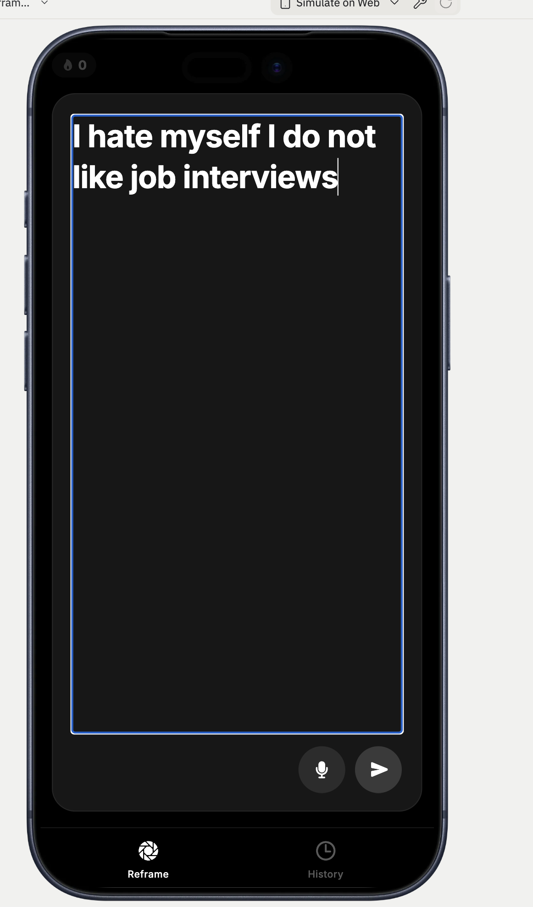
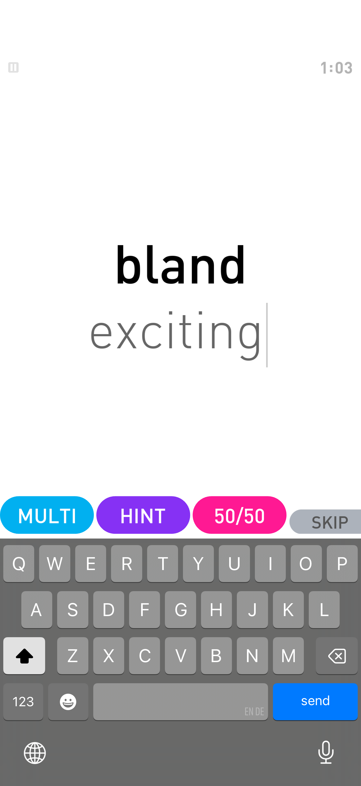
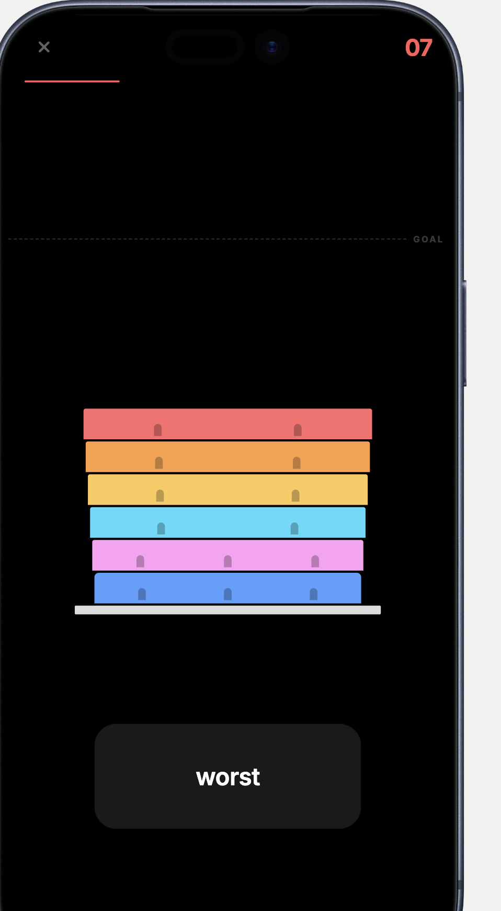
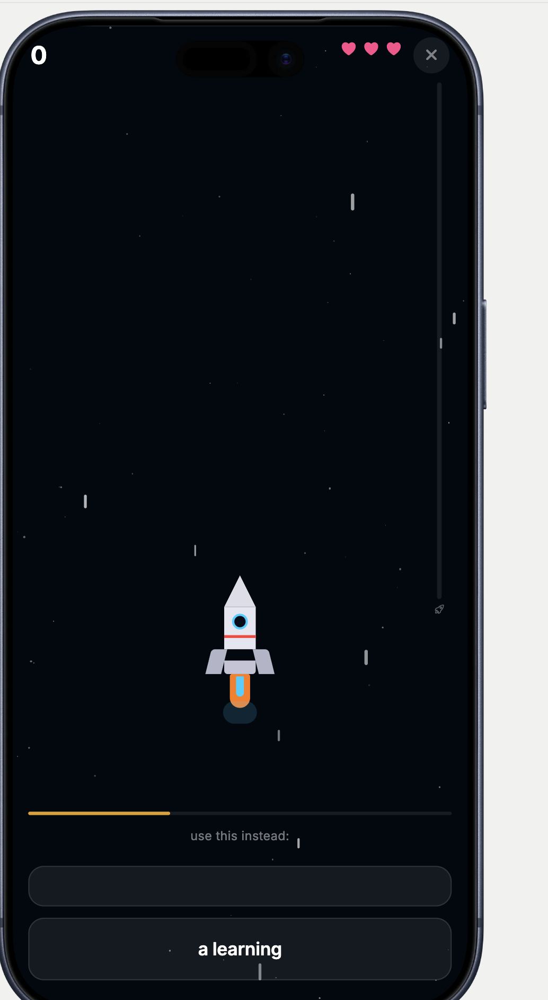
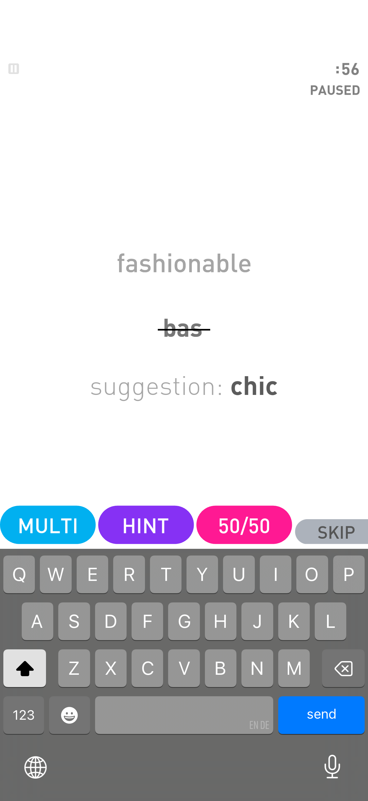
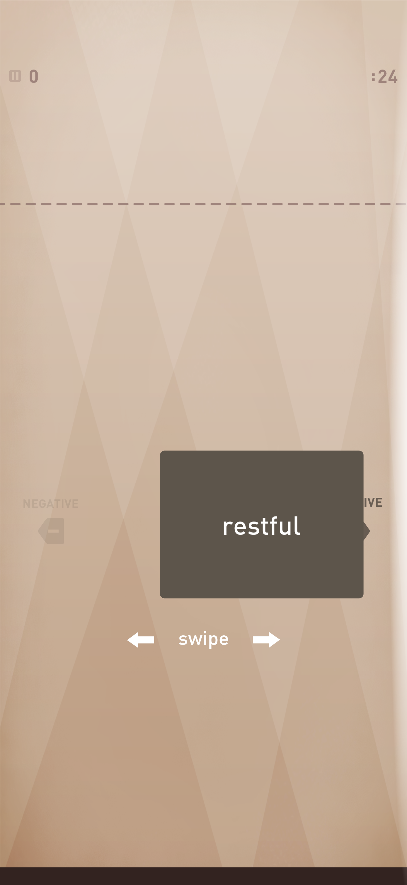
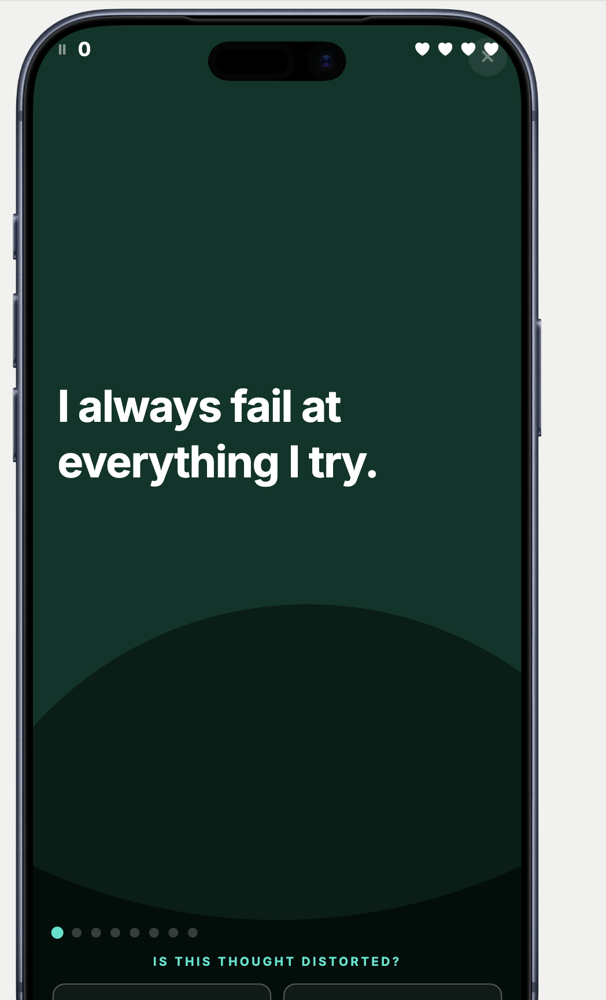
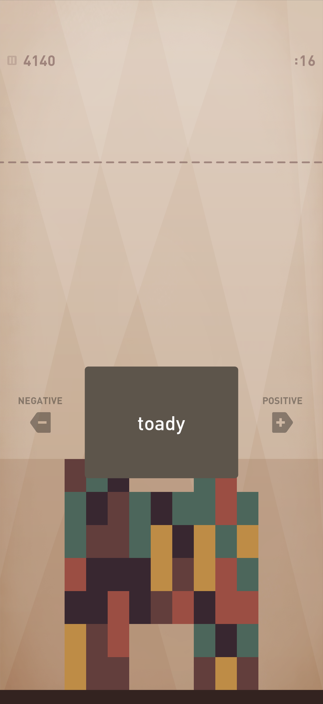

<div align="center">

# Cognitive Reframing

**A gamified mobile app that helps users rewrite distorted thinking patterns using CBT techniques, powered by Claude AI.**

Built with React Native (Expo) + Express + Claude Sonnet

<br/>

<table>
  <tr>
    <td></td>
    <td></td>
    <td></td>
    <td></td>
  </tr>
  <tr>
    <td align="center"><sub>Capture</sub></td>
    <td align="center"><sub>Reframe</sub></td>
    <td align="center"><sub>Sort Tower</sub></td>
    <td align="center"><sub>Rocket Quiz</sub></td>
  </tr>
</table>

</div>

<br/>

## How It Works

You type a thought like *"I always fail at everything"*. Claude AI analyses every word, flags the ones carrying cognitive distortion weight, explains why each is distorted, and suggests healthier replacements. You then work through those words using interactive mini-games — progressively reframing your thinking in a low-pressure, satisfying way.

**The core loop:**

```
Capture  ───>  Annotate  ───>  Reframe  ───>  Practice
  │               │               │               │
  │  Write a      │  Claude AI    │  Tap a word,  │  Revisit past
  │  thought      │  labels each  │  play the     │  thoughts via
  │  freely       │  distorted    │  GamePanel,   │  five mini-games
  │               │  word by      │  replace it   │  in the History
  │               │  category     │  with a       │  tab
  │               │               │  better one   │
```

---

## The Psychology

Cognitive Behavioural Therapy (CBT) holds that the way we *interpret* events — not the events themselves — shapes how we feel and behave. When our internal language is dominated by cognitive distortions, our emotional responses become disproportionate to reality.

This app targets four distortion categories:

| Category | Example Words | What It Signals |
|---|---|---|
| **Absolute** | always, never, everyone, nothing | Black-and-white thinking that removes nuance |
| **Belief** | worthless, useless, failure, broken | Fixed negative core beliefs about the self |
| **Fear** | terrified, dreading, anxious, panic | Fear-driven appraisals of threat |
| **Self-judgment** | pathetic, loser, I can't do anything right | Harsh internal criticism of one's whole self |

By naming these words, understanding why they're distorted, and actively replacing them, users develop **metacognitive awareness** — the ability to notice and interrupt unhelpful thought patterns before they escalate.

---

## Architecture

### System Overview

```
┌─────────────────────────────────────────────────────────────────┐
│                        MOBILE CLIENT                            │
│                   React Native / Expo Router                    │
│                                                                 │
│  ┌──────────┐   ┌──────────────┐   ┌────────────────────────┐  │
│  │ Capture  │──>│   Annotated  │──>│      GamePanel          │  │
│  │ Screen   │   │   Thought    │   │  REFRAME | HINT | 50/50 │  │
│  └──────────┘   └──────────────┘   └────────────────────────┘  │
│        │                                      │                 │
│        │              ┌───────────────────────┘                 │
│        ▼              ▼                                         │
│  ┌─────────────────────────┐                                   │
│  │     Context Layer        │                                   │
│  │  GameContext (session)   │                                   │
│  │  HistoryContext (async)  │                                   │
│  │  StreakContext (async)   │                                   │
│  └─────────────────────────┘                                   │
│              │                                                  │
│              │  POST /api/reframe { thought: "..." }            │
└──────────────┼──────────────────────────────────────────────────┘
               │
               ▼
┌──────────────────────────────────────────────────────────────── ┐
│                       API SERVER                                │
│                   Express / TypeScript                          │
│                                                                 │
│  ┌────────────┐    ┌──────────────┐    ┌────────────────────┐  │
│  │  Request    │──>│   Claude AI   │──>│  Zod Validation    │  │
│  │  Validation │   │  (Sonnet)     │   │  + JSON Extraction │  │
│  └────────────┘    └──────────────┘    └────────────────────┘  │
│                                                                 │
│  Structured logging (Pino) · CORS · Health check endpoint       │
└─────────────────────────────────────────────────────────────────┘
               │
               ▼
┌─────────────────────────────────────────────────────────────────┐
│                      CLAUDE AI (Sonnet)                         │
│                                                                 │
│  Receives a CBT system prompt + the user's thought.             │
│  Returns a structured JSON array — one object per word:         │
│                                                                 │
│  {                                                              │
│    word: "always",                                              │
│    category: "absolute",                                        │
│    reframes: ["sometimes", "often", "occasionally"],            │
│    hint: "Try 'sometimes'",                                     │
│    fiftyFifty: ["sometimes", "constantly"],                     │
│    explainer: "This is absolute language that leaves no room…"  │
│  }                                                              │
└─────────────────────────────────────────────────────────────────┘
```

### State Management

The app uses three React Context providers with a clear separation of concerns:

```
┌───────────────────────────────────────────────────────────┐
│                     GameContext                            │
│                   (session only)                           │
│                                                           │
│  screen: "capture" | "cloud" | "game"                     │
│  thought: string                                          │
│  words: WordAnalysis[]                                    │
│  reframedWords: Record<index, reframe>                    │
│  activeWordIndex: number | null                           │
│                                                           │
│  Transitions:                                             │
│    capture ── setWords() ──────────> cloud                │
│      ▲                                 │                  │
│      └── goToCapture() ───────────     │                  │
│                                   │    │                  │
│    cloud ──── openGame(idx) ──────┼──> game               │
│      ▲                            │    │                  │
│      └── closeGame() / markReframed() ─┘                  │
└───────────────────────────────────────────────────────────┘

┌───────────────────────────────────────────────────────────┐
│                   HistoryContext                           │
│              (persisted — AsyncStorage)                    │
│                                                           │
│  Up to 100 entries, each containing:                      │
│    - Original thought text                                │
│    - Full AI word analysis                                │
│    - Map of reframed words                                │
│    - Timestamp                                            │
│                                                           │
│  Feeds data to all five reinforcement mini-games          │
└───────────────────────────────────────────────────────────┘

┌───────────────────────────────────────────────────────────┐
│                    StreakContext                            │
│              (persisted — AsyncStorage)                    │
│                                                           │
│  currentStreak · longestStreak · lastReflectionDate       │
│                                                           │
│  Increments daily on first reflection, resets if a        │
│  day is missed. Drives the streak badge in the tab bar.   │
└───────────────────────────────────────────────────────────┘
```

### AI Pipeline Detail

The `/api/reframe` endpoint orchestrates a structured conversation with Claude:

1. **System prompt** — a carefully crafted CBT prompt that instructs Claude to analyse every word (including neutral ones) so the response array maps positionally to the original sentence
2. **Structured output** — Claude returns a JSON object with a `words` array, where each entry includes category, reframes, hint, fiftyFifty, and explainer
3. **Validation** — the raw response is regex-extracted (Claude sometimes wraps JSON in code fences), parsed, and validated against a Zod schema before reaching the client
4. **Positional mapping** — neutral words are included with empty fields so `words[i]` always corresponds to the i-th word of the original thought, avoiding fragile fuzzy matching

---

## Mini-Games

Five reinforcement games in the History tab help users internalise reframing skills through spaced repetition and active recall. Each game draws from the user's own past thoughts.

| Game | Mechanic | CBT Skill Trained |
|---|---|---|
| **GamePanel** | Free-text input with REFRAME / HINT / 50-50 / SKIP actions and a 45s timer. Fuzzy matching (Levenshtein) allows minor typos. | Core reframing — substituting a distorted word with a balanced alternative |
| **Sort Tower** | Swipe cards left (negative) or right (positive). Correct sorts stack colourful floors on a pixel-art tower. 30s timer. | Rapid categorical recognition — labelling words as distorted vs. healthy |
| **Rocket** | Multiple-choice quiz. Correct answers boost the rocket; gravity pulls it down. 3 lives. | Association drilling — linking distorted words to their reframes under pressure |
| **Thought Check** | Full sentences shown — tap ERROR or VALID. Streak multiplier for consecutive correct answers. | Sentence-level distortion detection |
| **Sail** | Individual words highlighted in context — is this word distorted? Binary ERROR/VALID choice. | Word-level distortion spotting within natural language |
| **Reword** | Branching tree — a distorted word at the root, three options at the leaves. Only one is a true reframe; the other two are still distorted. | Nuanced word selection — distinguishing genuine reframes from "replacing one distortion with another" |

<table>
  <tr>
    <td></td>
    <td></td>
    <td></td>
    <td></td>
  </tr>
  <tr>
    <td align="center"><sub>GamePanel (hint)</sub></td>
    <td align="center"><sub>Sort Tower</sub></td>
    <td align="center"><sub>Thought Check</sub></td>
    <td align="center"><sub>Tower Growing</sub></td>
  </tr>
</table>

---

## Data Flow: A Single Thought

```
User types: "I always fail at everything"
                    │
                    ▼
        ┌──────────────────────┐
        │   CaptureScreen      │  thought state via GameContext
        │   onSubmit(thought)  │
        └──────────┬───────────┘
                   │
                   ▼
        ┌──────────────────────┐
        │   React Query        │  POST /api/reframe { thought }
        │   useMutation        │
        └──────────┬───────────┘
                   │
                   ▼
        ┌──────────────────────┐
        │   Express Server     │  Validates input
        │   /api/reframe       │  Calls Claude with CBT system prompt
        └──────────┬───────────┘
                   │
                   ▼
        ┌──────────────────────┐
        │   Claude Sonnet      │  Analyses word by word
        │                      │  Returns structured JSON
        └──────────┬───────────┘
                   │
                   ▼
        ┌──────────────────────┐
        │   Zod Validation     │  Schema check + JSON extraction
        └──────────┬───────────┘
                   │
                   ▼
        ┌──────────────────────┐
        │   onSuccess callback │  Maps response to WordAnalysis[]
        │                      │
        │   addEntry()         │  ──> HistoryContext (persisted)
        │   recordReflection() │  ──> StreakContext  (persisted)
        │   setWords()         │  ──> GameContext    (screen → "cloud")
        └──────────┬───────────┘
                   │
                   ▼
        ┌──────────────────────┐
        │  AnnotatedThought    │  Colour-coded distortion chips
        │  User taps a word    │
        └──────────┬───────────┘
                   │
                   ▼
        ┌──────────────────────┐
        │   GamePanel          │  45s timer, free-text + hints
        │   markReframed()     │  Word turns green in annotation view
        │   updateEntry()      │  Syncs to HistoryContext
        └──────────────────────┘
```

---

## Project Structure

```
Anthitherapistv2/
│
├── artifacts/
│   ├── mobile/                     # Expo React Native app
│   │   ├── app/                    # Expo Router — file-based screens
│   │   │   ├── _layout.tsx         #   Root layout, providers, fonts
│   │   │   ├── index.tsx           #   Home tab (Reframe)
│   │   │   └── history.tsx         #   History & Games tab
│   │   │
│   │   ├── components/
│   │   │   ├── CaptureScreen.tsx   #   Dual-layer capture/review UI
│   │   │   ├── AnnotatedThought.tsx#   Colour-coded distortion chips
│   │   │   ├── GamePanel.tsx       #   Bottom-sheet reframing modal
│   │   │   ├── ThinkingAnimation.tsx#  Orbital loading animation
│   │   │   ├── LetterTumble.tsx    #   Celebration animation
│   │   │   ├── TabBar.tsx          #   Glassmorphic tab bar + streak badge
│   │   │   ├── GameCarousel.tsx    #   Horizontal game entry cards
│   │   │   ├── SortTowerGame.tsx   #   Swipe-to-sort card game
│   │   │   ├── RocketGame.tsx      #   Multiple-choice rocket quiz
│   │   │   ├── ThoughtCheckGame.tsx#   Sentence distortion checker
│   │   │   ├── SailGame.tsx        #   Word-level distortion spotter
│   │   │   └── RewordGame.tsx      #   Branching-tree word substitution
│   │   │
│   │   ├── context/
│   │   │   ├── GameContext.tsx      #   Active session state
│   │   │   ├── HistoryContext.tsx   #   Persistent reflection log
│   │   │   └── StreakContext.tsx     #   Daily streak tracking
│   │   │
│   │   └── constants/
│   │       └── colors.ts           #   Design tokens (distortion colours)
│   │
│   └── api-server/                 # Express API
│       └── src/
│           ├── index.ts            #   Server entry point
│           ├── app.ts              #   Express app (middleware stack)
│           ├── routes/
│           │   ├── index.ts        #   Route aggregator
│           │   ├── health.ts       #   GET /api/healthz
│           │   └── reframe/
│           │       └── index.ts    #   POST /api/reframe (AI pipeline)
│           └── lib/
│               └── logger.ts       #   Pino structured logger
│
├── packages/
│   ├── api-zod/                    # Shared Zod schemas
│   └── api-client-react/           # React Query hooks from API types
│
└── integrations/
    └── anthropic-ai/               # Anthropic API client
```

---

## API Reference

| Route | Method | Description |
|---|---|---|
| `/api/healthz` | `GET` | Liveness check — returns `{ status: "ok" }` |
| `/api/reframe` | `POST` | Analyses a thought with Claude AI. Expects `{ thought: string }`. Returns `{ words: WordAnalysis[] }` |

**WordAnalysis schema:**

```typescript
{
  word: string;                                        // The original word
  category: "neutral" | "absolute" | "belief"          // Distortion category
           | "fear" | "self_judgment";
  reframes: string[];                                  // 3-5 healthier alternatives
  hint: string | null;                                 // Gentle nudge toward a reframe
  fiftyFifty: [correct_reframe, plausible_decoy];      // For the 50/50 game mode
  explainer: string | null;                            // Why this word is distorted
}
```

---

## Design System

Distortion categories are colour-coded throughout the entire app:

| Category | Colour | Hex |
|---|---|---|
| Belief | Red | `#FF5B5B` |
| Fear | Purple | `#9B5CF6` |
| Absolute | Orange | `#F97316` |
| Self-judgment | Pink | `#EC4899` |
| Neutral | Dark grey | `#2A2A3E` |
| Success (reframed) | Green | `#00E5A0` |

The UI uses a dark theme (`#0A0A0F` background) with glassmorphic surfaces and spring-based Reanimated animations for all transitions.

---

## Setup & Running Locally

### Prerequisites

- Node.js 20+
- pnpm 9+
- Expo Go app (for device testing) or an iOS/Android simulator
- Anthropic API key (via Replit integration or `ANTHROPIC_API_KEY` env var)

### Install & Run

```bash
# Install all workspace dependencies
pnpm install

# Start the API server
pnpm --filter api-server dev

# Start the mobile app (in a separate terminal)
pnpm --filter mobile start
```

### Environment Variables

| Variable | Where | Purpose |
|---|---|---|
| `PORT` | API server | Port the Express server binds to |
| `NODE_ENV` | API server | `production` switches logger to JSON output |
| `LOG_LEVEL` | API server | Pino log level (default: `info`) |
| `EXPO_PUBLIC_DOMAIN` | Mobile app | Base domain for API requests |

---

## Tech Stack

| Layer | Technology |
|---|---|
| Mobile | React Native, Expo, Expo Router, Reanimated, Gesture Handler |
| State | React Context, AsyncStorage |
| API | Express, TypeScript, Zod, Pino |
| AI | Claude Sonnet (Anthropic Messages API) |
| Monorepo | pnpm workspaces |

---

<div align="center">
<sub>Built with Claude AI by <a href="https://github.com/lukataylo">lukataylo</a></sub>
</div>
